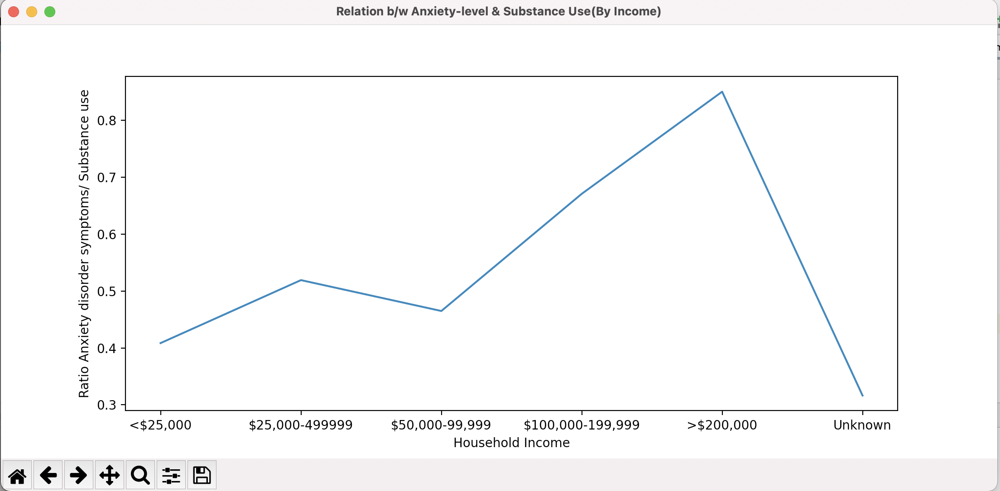

#  Impact-of-Covid-on-Mental-Health

Study on effects of the
Pandemic on stress, anxiety and depression levels and an insight on their
subsequent correlation with Impact on Drug Use and Suicidal Ideation


## Authors

- Kushagra Raghuvanshi (kushagra2125@gmail.com)
- Jacob Grimm
- Madhav Garg


## Documentation

[Project Documentation link (PDF and Latex version)](https://www.overleaf.com/read/srcqwkbvvwgw)


## Screenshots





## Run Locally

Clone the project

```bash
  git clone https://link-to-project
```

Go to the project directory

```bash
  cd my-project
```

Install dependencies

```bash
  npm install
```

Start the server

```bash
  npm run start
```

